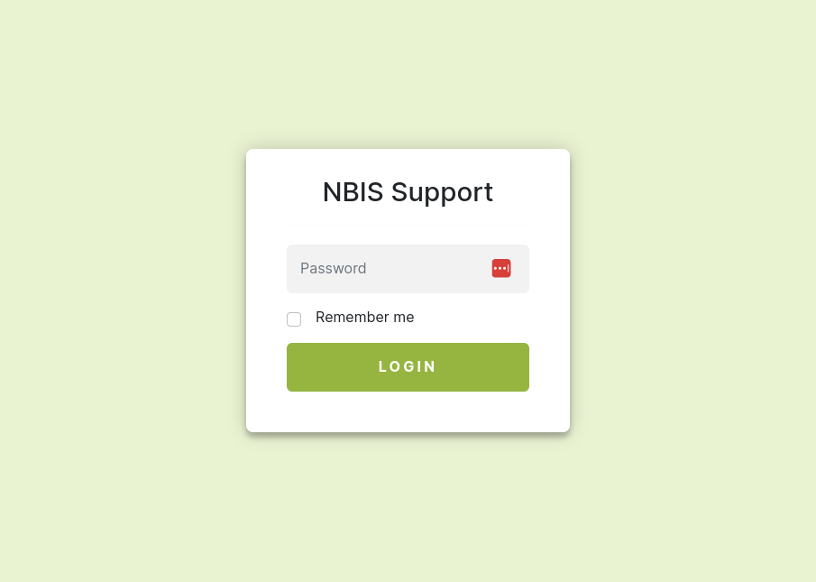

# StatiCrypt



## Usage

### Docker

- Navigate to the directory with the html file to encrypt
- The command overwrites **index.html** with encrypted version.

```
docker pull ghcr.io/royfrancis/staticrypt:3.1.0
docker run --rm -v $PWD:/home/work ghcr.io/royfrancis/staticrypt:3.1.0 staticrypt index.html --short -p mypassword
```

Alternatively, password can be defined inside an **.env** file like this:

```
STATICRYPT_PASSWORD="mypassword"
```

and then run

```
docker run --rm -v $PWD:/home/work ghcr.io/royfrancis/staticrypt:3.1.0 staticrypt index.html --short
```

- For more options, 

```
docker run --rm ghcr.io/royfrancis/staticrypt:3.1.0 staticrypt --help
```

### Using GitHub Actions

GA encrypts **index.html** using password in the the **.env** file, commits the changes and pushes the changes back.

See [gh-pages branch](https://github.com/royfrancis/staticrypt/tree/gh-pages) for an example.

- Copy the github action and set **push:branches** and **env:branch** as needed
- Input password into **.env** file OR create an environment variable `STATICRYPT_PASSWORD`
- Add environment variable `TOKEN` to push changes back
- Optionally, add a badge for the job

### Using NodeJS

- Prepare an environment with NodeJS.

```
git clone https://github.com/royfrancis/staticrypt.git
git checkout bootstrap
npm install -g
```

- Navigate to the directory with the html file to encrypt
- The command overwrites **index.html** with encrypted version.

```
staticrypt index.html -p mypassword --short
```

For more options, `staticrypt --help`

## Acknowledgements

Built on [StatiCrypt](https://github.com/robinmoisson/staticrypt/)

---

2023 • Roy Francis