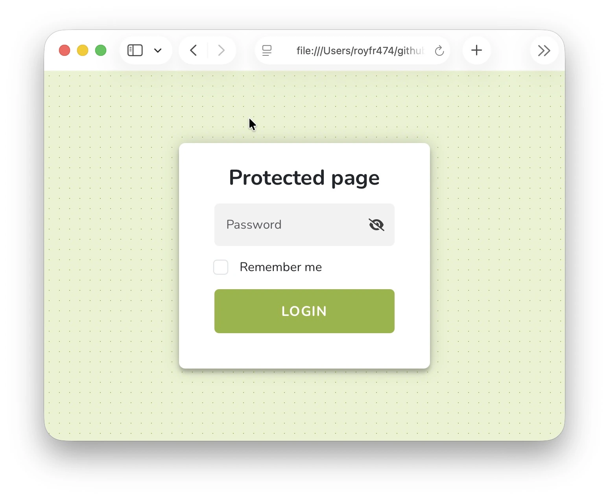

# :lock: StatiCrypt 

[](https://github.com/royfrancis/staticrypt/actions?workflow=docs) [](https://github.com/royfrancis/staticrypt/pkgs/container/staticrypt) [](https://hub.docker.com/repository/docker/royfrancis/staticrypt)



Password Protect HTML Pages with StatiCrypt. For more information, visit the [Documentation Site](https://royfrancis.github.io/staticrypt/).

## Quick start

Using docker:

```bash
# exports to a directory named 'encrypted' inside the current directory
docker run --rm -v $PWD:/home/work ghcr.io/royfrancis/staticrypt:latest index.html -p mylongpassword

# to overwrite the original file
docker run --rm -v $PWD:/home/work ghcr.io/royfrancis/staticrypt:latest index.html -d . -p mylongpassword

# recursively encrypt and overwrite all html files in a folder
docker run --rm -v $PWD:/home/work ghcr.io/royfrancis/staticrypt:latest path/to/folder/* -r -d . -p mylongpassword
```

Using nodejs npm:

```bash
# create environment
conda create -n nodejs-24 nodejs=24 -c conda-forge
conda activate nodejs-24

# clone repo and install
git clone https://github.com/royfrancis/staticrypt.git
git checkout bootstrap
npm install -g
staticrypt --version

# encrypts and outputs to a directory named 'encrypted' inside the current directory
staticrypt index.html -p mylongpassword
# to overwrite the original file
staticrypt index.html -d . -p mylongpassword
# to recursively overwrite all html files in a folder
staticrypt path/to/folder/* -d path/to/folder -r -p mylongpassword
```

## Updating

- `npm install -g` to update the global package
- Evaluate that all tests pass: `npm test`
- To preview documentation; `npm install` then `npm run docs:dev`
- Update version in `package.json`
- Update version in `docker/README.md`
- Check env versions are same in conda and docker
- Check versions in github actions

## Acknowledgements

- Built on [StatiCrypt](https://github.com/robinmoisson/staticrypt/)

---

2026 • Roy Francis
