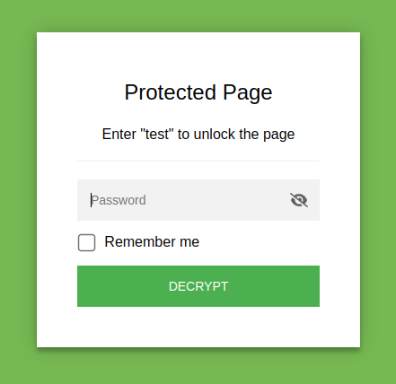

# StatiCrypt



## Usage

### Docker

- Navigate to the directory with the html file to encrypt
- The command overwrites **index.html** with encrypted version.

```
docker pull ghcr.io/royfrancis/staticrypt:gallium-alpine3.17
docker run --rm -v $PWD:/home/work ghcr.io/royfrancis/staticrypt:gallium-alpine3.17 staticrypt index.html --short -p mypassword
```

Alternatively, password can be defined inside an **.env** file like this:

```
STATICRYPT_PASSWORD="mypassword"
```

and then run

```
docker run --rm -v $PWD:/home/work ghcr.io/royfrancis/staticrypt:gallium-alpine3.17 staticrypt index.html --short
```

- For more options, 

```
docker run --rm -v $PWD:/home/work ghcr.io/royfrancis/staticrypt:gallium-alpine3.17 staticrypt --help
```

### Using NodeJS

- Prepare an environment with NodeJS.

```
git clone https://github.com/royfrancis/staticrypt.git
git checkout bootstrap
npm install -g
```

- Navigate to the directory with the html file to encrypt
- The command overwrites **index.html** with encrypted version.

```
staticrypt index.html -p mypassword
```

For more options, `staticrypt --help`.

## Acknowledgements

Built on [StatiCrypt](https://github.com/robinmoisson/staticrypt/).

---

2023 | Roy Francis